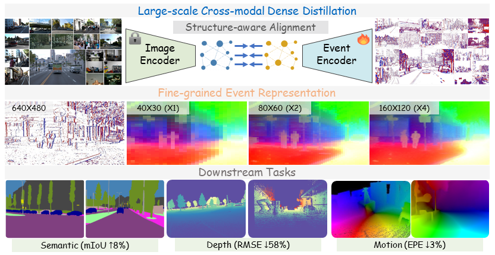
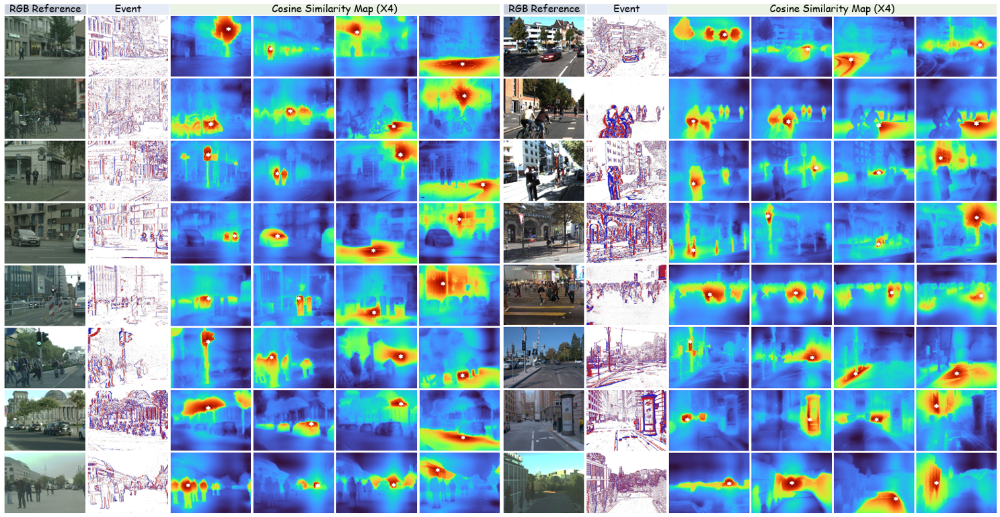

### The project is not fully organized yet; please try again around May 27, 2026.

<div align="center">
  <h3 align="center"><strong>Scaling Dense Event-Stream Pretraining from Visual Foundation Models [CVPR'26 Highlight] </strong></h3>
    <p align="center">
    <a>Zhiwen Chen</a><sup>1</sup>&nbsp;&nbsp;
    <a>Junhui Hou</a><sup>1</sup>&nbsp;&nbsp;
    <a>Zhiyu Zhu</a><sup>1</sup>&nbsp;&nbsp;
    <a>Jinjian Wu</a><sup>2</sup>&nbsp;&nbsp;
    <a> Guangming Shi</a><sup>2</sup>&nbsp;&nbsp;
    <br>
    <sup>1</sup>City University of Hong Kong&nbsp;&nbsp;&nbsp;
    <sup>2</sup>Xidian University&nbsp;&nbsp;&nbsp;
</div>

<p align="center">
  <a href="https://arxiv.org/pdf/2603.03969" target='_blank'>
    
  </a>
</p>


###  About
Learning fine-grained representations from irregular event streams is challenging due to limited annotations and scalability issues. This project introduces a novel self-supervised pretraining method that distills Visual Foundation Models (VFMs) to enhance event representations at scale.
<div align="center">
  
</div>


### 📋 To-Do List
- [x] [2026.5.21] Release the code, data and model for dense event-stream pretraining
- [ ]  Release the code, data and model for event-based semantic segmentation
  
<!-- * [x] -->
<!-- - ☑️ -->

### 😀 Quick Start
#### ⚙️ 1. Installation
Clone the repository locally:
```
pip install git+https://github.com/zhiwen-xdu/ScaleEvent.git
```

#### 💾 2. Data Preparation
We release our main simulated (VID2E) and aligned pretraining data publicly. Other datasets can be downloaded and processed using the links provided in the supplementary materials of the paper.


<div align="center">

<table>
<tr>
  <th><sup> </sup></th>
  <th><sup>Cityscapes</sup></th>
  <th><sup>KITTI</sup></th>
  <th><sup>DECD</sup></th>
  <th><sup>M3ED</sup></th>
  <th><sup>Waymo</sup></th>
  <th><sup>VisEvent+CoeSot</sup></th>
</tr>

<tr>
  <td><sup><b>Pretrained RGB-Event Data</b></sup></td>

  <td><sup><a href="https://drive.google.com/file/d/11daMsgYAhqyWReVcVwFACqQPkt6dSth-/view?usp=sharing">DOWNLOAD</a></sup></td>

  <td><sup><a href="https://drive.google.com/file/d/1LSsPIJCYfh-jLeueu1J-S32HIh8OKmIG/view?usp=sharing">DOWNLOAD</a></sup></td>
  
  <td><sup><a href="https://drive.google.com/file/d/13oNOAfinTOgZCW6e1l2ATeCuPXiRYtV9/view?usp=sharing">DOWNLOAD</a></sup></td>

  <td><sup><a href="https://drive.google.com/file/d/1JoF7siu_aHL0SBUyr0N-dM7eLlZtzauQ/view?usp=sharing">DOWNLOAD</a></sup></td>

  <td><sup><a href="https://drive.google.com/file/d/1Y9L7oESqdKJjXZeUDPtiD0egBOZEfCgE/view?usp=sharing">DOWNLOAD</a></sup></td>

  <td><sup><a href="https://drive.google.com/file/d/1g6xQk8UFa1Y3X_3xFxW86sKg1egOzvKE/view?usp=sharing">DOWNLOAD</a></sup></td>
</tr>

</table>

</div>

Format of Pre-trained Datasets:
```Shell
├── Dataset A
    ├── Sequence Name
        ├── image      # RGB/Gray Images, input of teacher network (image-domain dinov3 backbone).
        ├── voxel     # Event-oriented Voxel-like Images, input of student network (event-domain feature encoder).
        ├── evimg     # Event-oriented Color Images, used to efficiently calculate event masks (event-image alignment).
    ├── ... 
├── Dataset B
    ├── ... 
```


#### 🚀 3. Pre-Training

```Shell
cd scale_event/pretrain/
python -m torch.distributed.launch \
    --nnodes=1 \
    --nproc_per_node=4 \
    --node_rank=0 \
    --master_addr=localhost \
    --master_port=22222 \
    pretrain_ddp.py
```


<div align="center">

<table>
<tr>
  <th><sup> </sup></th>
  <th><sup>ViT-S</sup></th>
  <th><sup>ViT-B</sup></th>
  <th><sup>ViT-L</sup></th>
</tr>

<tr>
  <td><sup><b>Pretrained RGB Backbone (DINOv3)</b></sup></td>

  <td><sup><a href="https://drive.google.com/file/d/1_RKZQDvnX28zCqG3jMCOLPJBvTXMqIzM/view?usp=sharing">DOWNLOAD</a></sup></td>

  <td><sup><a href="https://drive.google.com/file/d/1fhd_ouLw5B5aCTXEE4ca3tsU2ZEPt3iK/view?usp=sharing">DOWNLOAD</a></sup></td>

  <td><sup><a href="https://drive.google.com/file/d/1At9lqNUJKiPOK8NCEh4ugEkLQSvNE2Al/view?usp=sharing">DOWNLOAD</a></sup></td>
</tr>

<tr>
  <td><sup><b>Pretrained Event Backbone (Ours)</b></sup></td>

  <td><sup><a href="https://drive.google.com/file/d/1NTIeHJSBAUTg4Plq2M9SCrtJAfp_7asJ/view?usp=sharing">DOWNLOAD</a></sup></td>

  <td><sup><a href="https://drive.google.com/file/d/1VQKAhDuzFO3DFjXqe4I4-JNk8oZdIkRu/view?usp=sharing">DOWNLOAD</a></sup></td>

  <td><sup><a href="https://drive.google.com/file/d/11DEi9U7MgnXgFKFgarFhwO7FH69iLsGz/view?usp=sharing">DOWNLOAD</a></sup></td>
</tr>


</table>

</div>

#### ⭐️ 4. Event Representations
The feature visualization tool (i.e., similarity map, pca_map, cluster map) used in the paper is from [Denoising-ViT](https://github.com/Jiawei-Yang/Denoising-ViT/blob/main/utils/visualization_tools.py).

<div align="center">
  
</div>


#### 📊 5. Downstream Tasks


###  Acknowledgments
Thanks to [Ev-Waymo](https://github.com/mickeykang16/Ev3DOD?tab=readme-ov-file) VID2E dataset, [VID2E](https://github.com/uzh-rpg/rpg_vid2e), [DINOv3](https://github.com/facebookresearch/dinov3), [EOMT](https://github.com/tue-mps/eomt), [Depth-Anything-V2](https://github.com/DepthAnything/Depth-Anything-V2), [SEA-RAFT](https://github.com/princeton-vl/SEA-RAFT) projects.

###  Contact
Feedbacks and comments are welcome! Feel free to contact us via [zhiwen.chen@cityu.edu.hk](zhiwen.chen@cityu.edu.hk)

### 📚 Citation
If you use ScaleEvent in your research, please use the following BibTeX entry.

```
@article{chen2026scaling,
  title={Scaling Dense Event-Stream Pretraining from Visual Foundation Models},
  author={Chen, Zhiwen and Hou, Junhui and Zhu, Zhiyu and Wu, Jinjian and Shi, Guangming},
  journal={arXiv preprint arXiv:2603.03969},
  year={2026}
}
```
